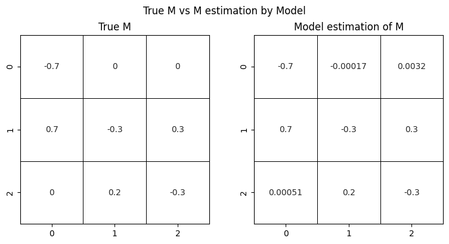
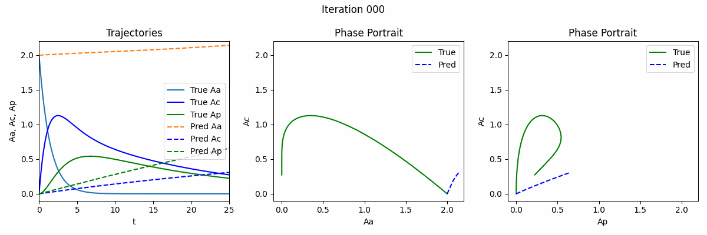

## neural ODE demo.py 

[colab link](https://colab.research.google.com/drive/1UKKPrahiNXUzEeUoK3NKfagqN494XHzt#scrollTo=Lv5jaRVP05Hn&uniqifier=2)

## Also mimic first order PO

[math derivation of ODE, first order PO](https://github.com/yingzibu/ODE/blob/main/note/first%20order%20PO%2C%20ODE.pdf) 

### One compartment model

[Code one compartment using neural ODE](https://github.com/yingzibu/ODE/blob/main/code/neural_ODE_first_order_PO_with_M_approx.ipynb)

### Two compartment model

[Code for two compartment using neural ODE](https://github.com/yingzibu/ODE/blob/main/code/neural_ODE_first_order_PO_two_compartment.ipynb)

