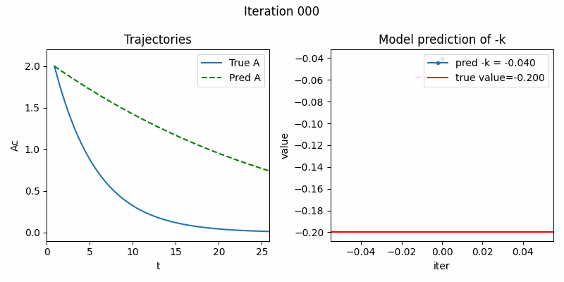

### One compartment IV

[Code](https://github.com/yingzibu/ODE/blob/main/experiment/IV/one_compartment/clean_version.ipynb)

#### When multiple dosing, the ODE is the same, yet IC changes, $A(t = \tau * \lambda) += MD$, in which $\tau$ is the dosing interval, and $\lambda$ is the dosing times, $MD$ is the maintenance dose. How to incorporate this inside odeint? 

[Code](https://github.com/yingzibu/ODE/blob/main/experiment/IV/one_compartment/multiple_dose_train_cycle_1.ipynb)

Just use one cycle of data to train the ODE, and use the ODE and different initial conditions to solve the whole curve

