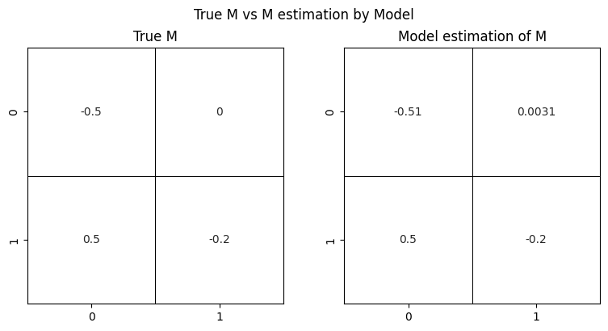

## In reality, we only have Ac data, which is the amount in plasma versus time relationship

I will test step by step

### Step 1: we still have Aa data, yet the loss function is changed into ||Ac - Ac_pred||, instead of the previous ||A - A_pred||

[Code](https://github.com/yingzibu/ODE/blob/main/experiment/PO/one_compartment/use_Aa_loss_Ac_only.ipynb)

### Step 2: We do not have Aa data. Missing data, ill-defined. Cannot put missing-value vector as input into NN. Find an alternative way

#### Alternative 1: same model, yet dim = 1 (only cares about Ac)

#### Alternative 2: model that could handle missing values: generative latent function time-series model
