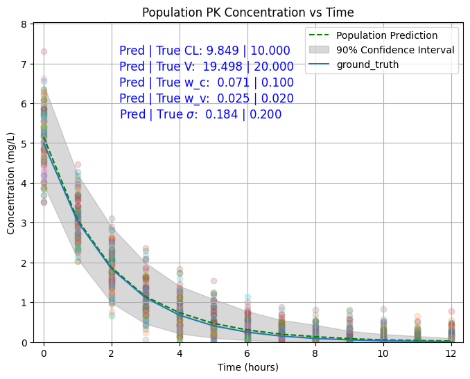
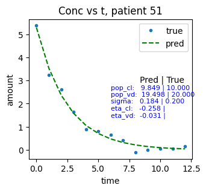

## Further modification needed:

1. NLLLoss could be normalized based on patient, instead of entries (multiple time points)

2. Currently 90% Confidence interval is calculated based on 1000 simulations. How do the popPK do CI calculation and how to reject/accept BE?

#### Current calculation is done by

1. Calculate pop parameters $\text{param}_{\text{pop}}$, once optimized, it could be fixed / trainable
2. initiate the $\eta \sim \mathcal{N}(0, \omega)$, and each patient's param has its unique $\eta$
    i.e. for dataset with patient num $= n$, random initiation $$\mathbf{\eta} \sim \mathcal{N}(0, \mathbf{\omega}),  \mathbf{\eta}\in \mathbb{R}^n, $$, and patients' specific params will be

   $`\text{param}_{\text{patient}} =\text{param}_{\text{pop}} \exp(\mathbf{\eta})`$, patients' specific conc. vs t calculation will be $`conc. = f(\text{param}_{\text{patient}}) + \text{err} = F(\text{param}_{\text{pop}}, \exp(\mathbf{\eta})) + \text{err}, \text{err} \sim \mathcal{N}(0, \sigma^2)`$
4. then train the model to minimize NLLLoss, once trained the whole dataset, update $\mathbf{\omega} = \text{var} (\mathbf{\eta})$, 
   train multiple epochs. Update optimized $\mathbf{\eta}$ and $\sigma$

   until the loss does not drop, stop train.
   
  * Problem 1: mean of $\mathbf{\eta}$ may not be $\mathbf{0}$.
  * Problem 2: is this method the same as the NONMEM?  
4.  Best model with the lowest loss is saved and reload to obtain the cpredicted pop parameters, $\omega$s and $\sigma$, compare those with true values
5.  90% CI was calculated based on 1000 simulations on $\eta \sim \mathcal{N}(0, \omega)$

 | gradient descent |  fixed pop params   | trainable pop params 
:-----:|:-------------------------:|:-------------------------:
|overall comparison|   |  
| prediction |  |  

